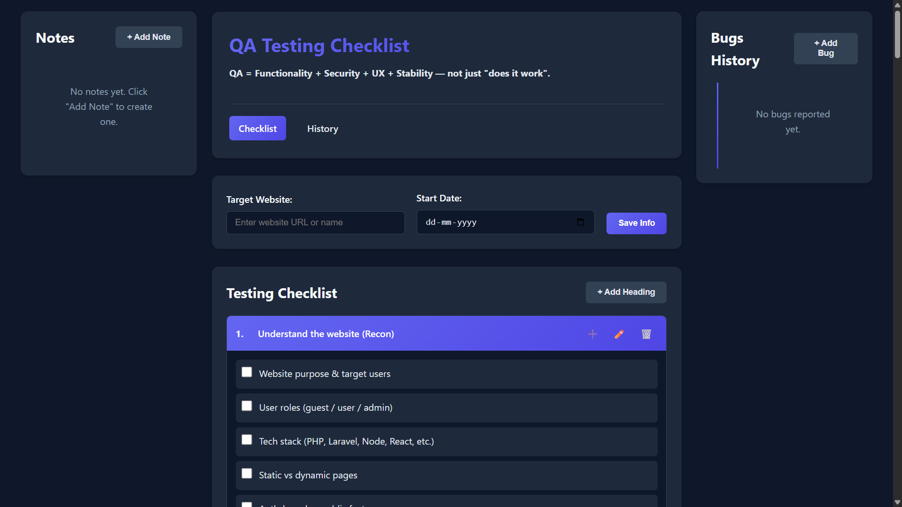
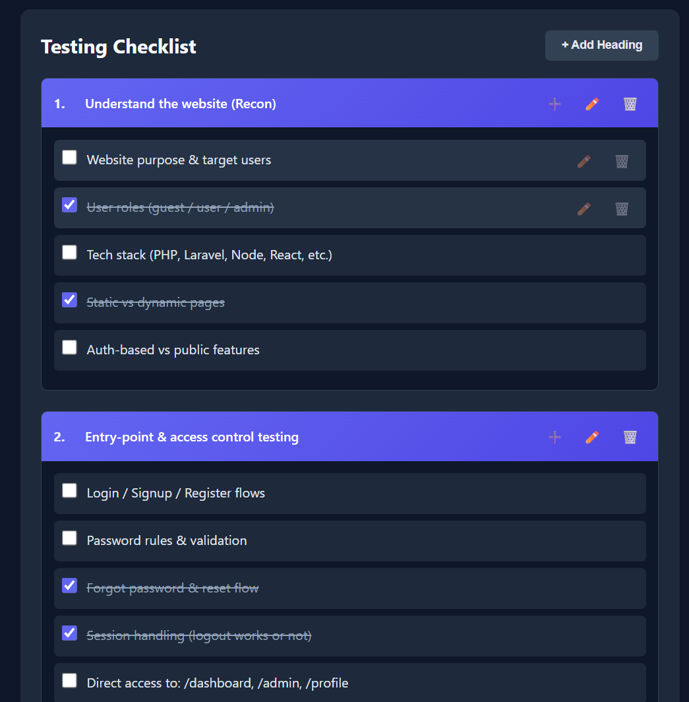
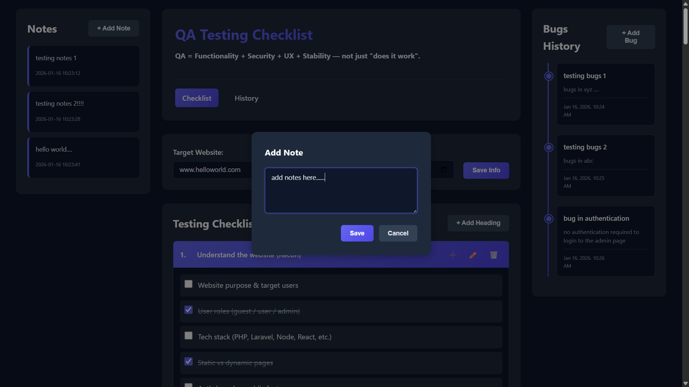
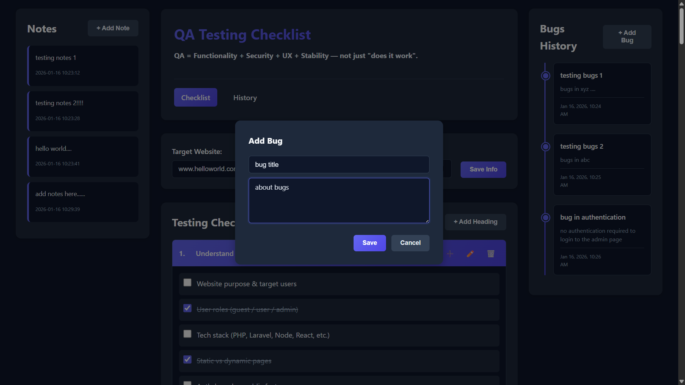
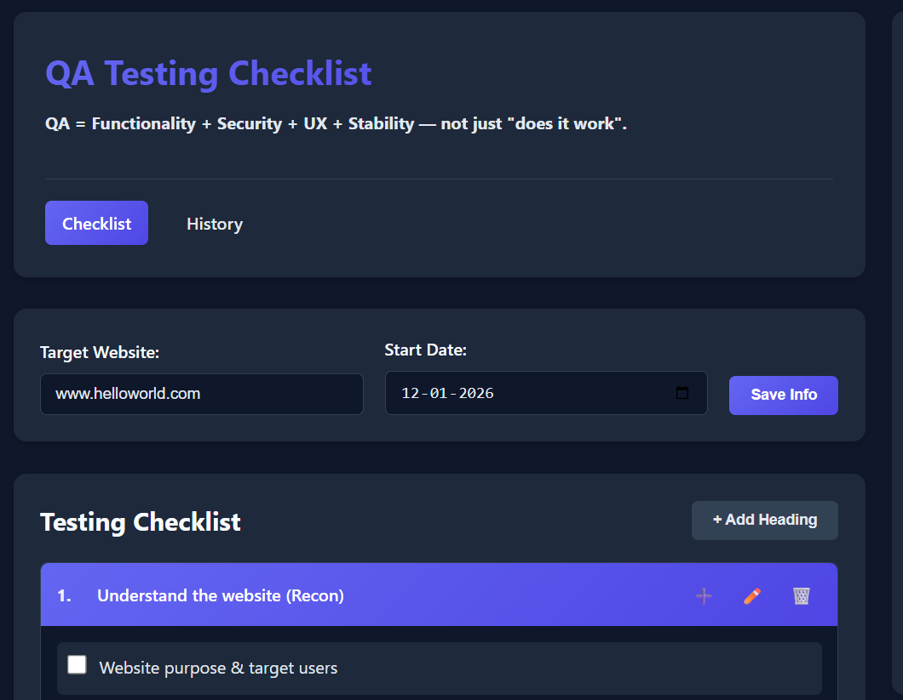
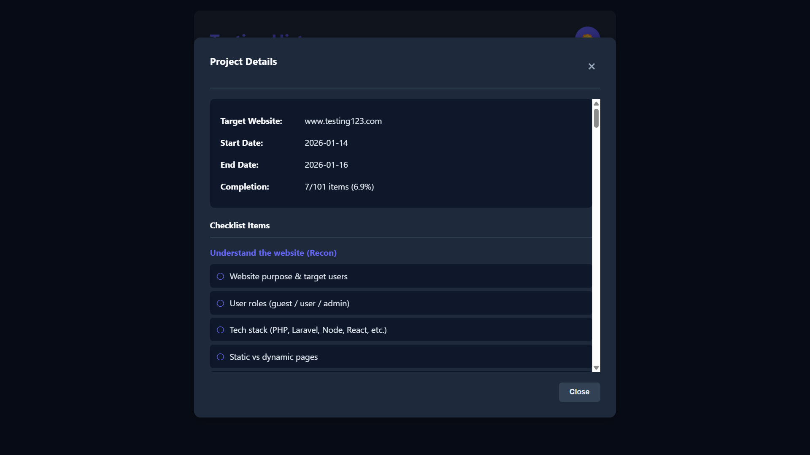
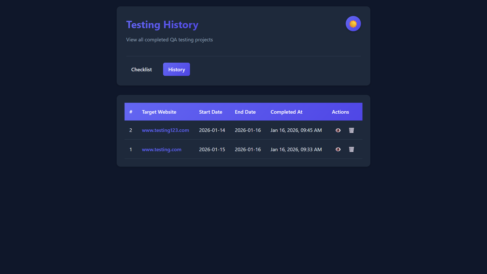
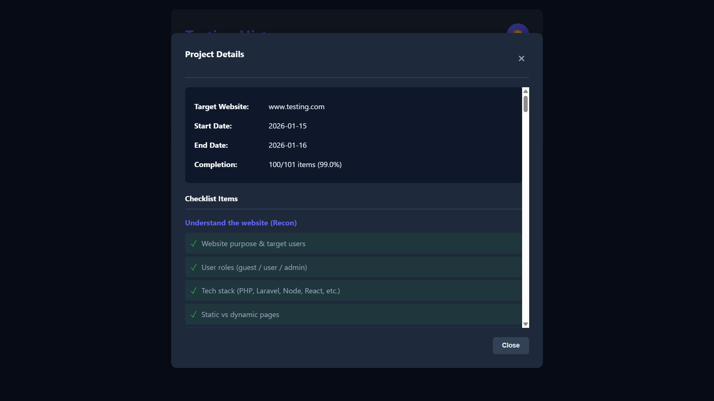

# QA Testing Checklist Application

A comprehensive web-based QA testing checklist application built with Flask and vanilla JavaScript. Track your website testing progress with structured checklists, notes, and bug history - all stored locally.



## Features

### 🎯 Core Functionality

#### **Structured Checklist Management**
- **Add/Edit/Delete Main Headings**: Organize your QA testing into logical categories (e.g., "Security Testing", "UI/UX Testing")
- **Add/Edit/Delete Sub-items**: Break down each category into specific test cases
- **Checkbox Tracking**: Mark items as completed and track your progress in real-time
- **Default Template**: Pre-loaded with 20 comprehensive QA testing categories covering functionality, security, UX, and stability



#### **Notes Section**
- Add quick notes during testing
- Edit or delete notes at any time
- Timestamp tracking for each note
- Perfect for documenting observations or quick findings



#### **Bug History Tracking**
- Report bugs with title and description
- Timeline-based visualization with creation timestamps
- Edit or delete bug reports
- Visual timeline indicator for easy tracking



#### **Session Management**
- **Target Website**: Specify which site you're testing
- **Start Date**: Track when testing began
- **Complete Session**: Save current session to history
- **Reset Session**: Clear current data and start fresh



#### **History & Reports**
- View all completed testing sessions
- Detailed project reports showing:
  - Completion percentage
  - All checked/unchecked items
  - Notes captured during testing
  - Bugs reported with timestamps
- Delete old history entries
- Export-ready format



### 💾 Data Persistence

All data is stored locally in JSON files:
- **Survives page refreshes** - Your work is never lost
- **Current session** saved in real-time
- **Completed sessions** preserved in history
- **No database required** - Simple file-based storage

### 🎨 User Interface

- **Clean, modern design** with light theme
- **Responsive layout** - Works on desktop and tablets
- **Intuitive controls** - Edit/delete actions on hover
- **Modal-based forms** - Clean, distraction-free editing
- **Visual feedback** - Progress tracking and item status

## Tech Stack

- **Backend**: Python 3.12.8 + Flask 3.1.2
- **Frontend**: Vanilla JavaScript (ES6+)
- **Styling**: Custom CSS with CSS Variables
- **Storage**: Local JSON files
- **No database required**

## Getting Started

### Prerequisites

- Python 3.12 or higher
- pip (Python package manager)

### Installation

1. **Clone the repository**
   ```bash
   git clone https://github.com/yourusername/qa-testing-checklist.git
   cd qa-testing-checklist
   ```

2. **Create a virtual environment** (recommended)
   ```bash
   python -m venv .venv
   ```

3. **Activate the virtual environment**
   - **Windows:**
     ```bash
     .venv\Scripts\activate
     ```
   - **macOS/Linux:**
     ```bash
     source .venv/bin/activate
     ```

4. **Install dependencies**
   ```bash
   pip install -r requirements.txt
   ```

5. **Run the application**
   ```bash
   python app.py
   ```

6. **Open your browser**
   ```
   Navigate to: http://127.0.0.1:10101
   ```


## Project Structure

```
qa-testing-checklist/
├── app.py
├── default_checklist.json
├── requirements.txt
├── README.md                  
├── screenshots/                
│   ├── main-interface.png
│   ├── checklist-section.png
│   ├── notes-section.png
│   ├── bugs-section.png
│   ├── session-info.png
│   ├── history-page.png
│   ├── project-details-modal.png
│   └── terminal-startup.png
├── static/
│   ├── css/
│   │   └── styles.css
│   └── js/
│       └── script.js
├── templates/
│   ├── index.html
│   └── history.html
└── data/
    ├── current_session.json
    └── completed.json
```

## Usage Guide

### Starting a New Testing Session

1. Enter the **Target Website** URL or name
2. Select the **Start Date**
3. Click **Save Info**


### Working with Checklists

**Add a New Heading:**
- Click "+ Add Heading" button
- Enter heading title
- Click Save

**Add Sub-items:**
- Click the ➕ icon on any heading
- Enter sub-item text
- Click Save

**Edit/Delete:**
- Hover over any heading or item
- Click ✏️ to edit or 🗑️ to delete

**Track Progress:**
- Check boxes as you complete items
- Progress is saved automatically

### Managing Notes

1. Click **"+ Add Note"**
2. Enter your note text
3. Click **Save**
- Notes are timestamped automatically
- Edit or delete using the hover icons

### Reporting Bugs

1. Click **"+ Add Bug"**
2. Enter bug **title** and **description**
3. Click **Save**
- Bugs appear in timeline format
- Timestamps track when each bug was found

### Completing a Session

1. Click **"Complete Testing"**
2. Confirm the action
3. Session moves to History
4. Current session resets with fresh checklist



### Viewing History

1. Navigate to **"History"** tab
2. Click the 👁️ icon to view project details
3. See full report with:
   - Completion statistics
   - All checklist items (checked/unchecked)
   - Notes with timestamps
   - Bugs with timestamps



## Default Checklist Categories

The application comes pre-loaded with 20 comprehensive QA testing categories:

1. Understand the website (Recon)
2. Entry-point & access control testing
3. Input validation & form testing
4. Security basics (non-intrusive)
5. Web console & client-side issues
6. API testing
7. Publicly accessible sensitive URLs
8. Authentication & authorization logic
9. UI / UX testing
10. Functional testing (core business logic)
11. Navigation & link testing
12. Error handling & messages
13. Performance & stability (basic)
14. Cross-browser & device testing
15. Accessibility
16. SEO & meta checks (basic QA)
17. Logging & monitoring (QA view)
18. Deployment & environment checks
19. Regression testing
20. Final reporting

Each category includes relevant sub-items for thorough testing coverage.

## Customization

### Modifying the Default Checklist

Edit `default_checklist.json` to customize your default checklist template:

```json
[
  {
    "id": 1,
    "title": "Your Custom Category",
    "items": [
      {"id": 1, "text": "Your test item", "checked": false}
    ]
  }
]
```

### Styling

Modify `static/css/styles.css` to customize the appearance:
- Light theme colors defined in `:root`
- CSS variables for easy color scheme changes

## Data Storage

All data is stored in the `data/` folder:

- **`current_session.json`**: Active testing session
- **`completed.json`**: Array of all completed sessions

Data persists across browser refreshes and application restarts.

## Contributing

Contributions are welcome! Please feel free to submit a Pull Request.

## License

This project is licensed under the MIT License.

## Support

If you encounter any issues or have questions, please open an issue on GitHub.

---

**Built with ❤️ for QA professionals who value thoroughness and organization.**